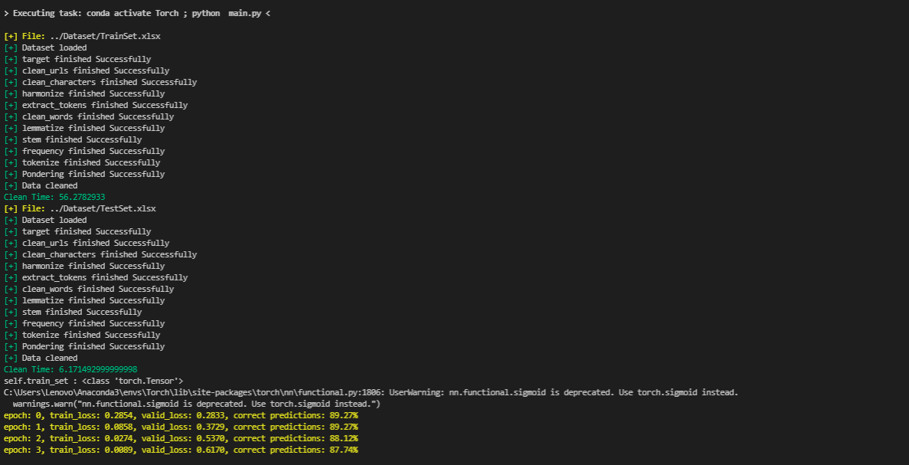
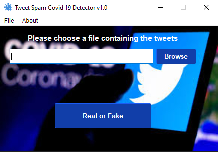
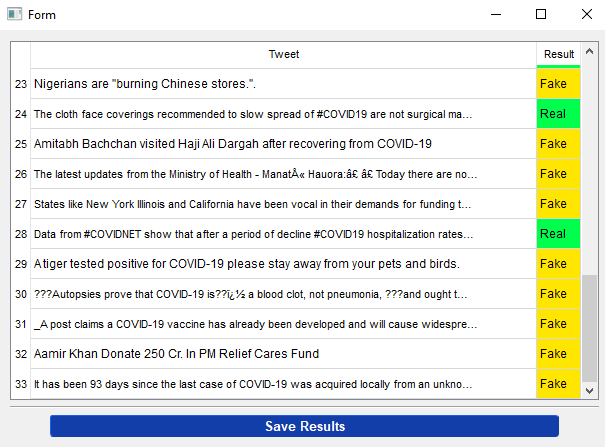

[](https://opensource.org/licenses/MIT) &emsp; 

<h1 align="center">
  <br>
  <a href="https://github.com/med-boubekri/SpamCOVID-19"></a>
  <br>
</h1>
<h4 align="center">Spam COVID-19 Detector</h4> 

**About this project** :

&emsp;&emsp;The goal of this project is to create a programme that predicts if a given tweet is fake or real.
## Install : 

&emsp;&emsp;I recommand using **Anaconda** environments , it really can save you a lot of trouble
In windows/linux execute the following in anaconda shell : 

```bash
$ conda create --name Torch python=3.9.7
$ conda activate Torch
$ git clone https://github.com/med-boubekri/Covid-Fact-Checker.git
$ cd Covid-Fact-Checker
$ pip install -r requirements.txt
$ python main.py
```
&emsp; and then you choose the tweets in the tweets folder for testing

## Manual: 
- **./main.py** : starts the programms 
- **gui/main_windows.py** : the main window gui
- **gui/results.py** : the results window gui 
- **guit/src/model.py**:  the Model class
- **gui/src/clean.py** : the Clean class 
- **tweets/tweets.txt** : file containing an example of tweets

## Results :
### &emsp; **Execution** : 
<h1 align="center">
  <br>
  <a href="https://github.com/med-boubekri/SpamCOVID-19"></a>
  <br>
</h1>

### &emsp; **Main Window** : 
<h1 align="center">
  <br>
  <a href="https://github.com/med-boubekri/SpamCOVID-19"></a>
  <br>
</h1>

### &emsp; **Results Window** : 
<h1 align="center">
  <br>
  <a href="https://github.com/med-boubekri/SpamCOVID-19"></a>
  <br>
</h1>
